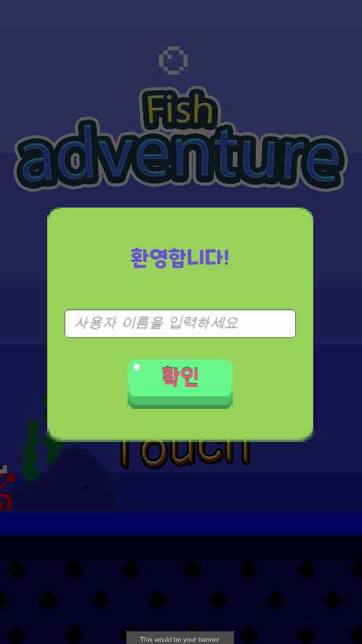

# FishGame
**Unity를 이용한 파이프 피하기 게임**

안녕하세요!  
Unity를 이용하여 만든 파이프 피하기 게임입니다.  

***
***FishGame 영상*** / ***FishGame video***

***
**게임소개**
<ul> 1.닉네임 입력  
처음 게임 시작시 자신만의 닉네임을 입력할 수 있도록 만들었습니다. 
</ul>

<ul> 2.물고기 애니메이션  
단순한 이미지가 아닌 애니메이션을 넣어 움직이는 효과와 보는 재미가 있도록 만들었습니다. 
파이프 충돌로 땅에 추락시 반짝이는 효과가 있습니다. 
</ul>

<ul> 3.움직이는 효과  
물고기는 좌우로 움직이지 않지만 배경과 이미지들을 움직여서 좌우로 이동하는 것과 같은 효과를 주었습니다. 
</ul>

<ul> 4.파이프 충돌 및 점수  
파이프 충돌시 게임오버가 되며 한 파이프를 통과할 때마다 점수가 추가됩니다.  
최고 점수를 향해 도전해보세요!  
</ul>

<ul> 5.게임 데이터 저장  
서버와 데이터베이스가 연결되어있어 사용자의 닉네임, 최고점수가 저장됩니다.  
게임 삭제 전까지는 데이터가 보존되니 걱정하지 마세요!  
</ul>

<ul> 6.게임오버 상태  
게임 오버가 되면 다시 시작할 수 있습니다.  
광고를 볼 수 있는 기능이 있습니다. 광고는 배너광고와 전면광고로 나뉩니다.  
이어하기 광고 클릭시 유니티 광고가 재생되며 이어하실 수 있습니다.  
</ul>

***

### 물고기가 멀리 모험을 떠날 수 있도록 도와주세요!

***

궁금한 점 및 요청사항은 아래 이메일을 참고해주세요. 
구글 이메일 tnwls9721@gmil.com 
네이버 이메일 chfhrtorthsk@naver.com 

***
## Engilsh
# FishGame
**Pipe game with Unity**

Hello!  
This is a pipe-free game created using Unity.  

***

**Introduction to the Games**
<Ul> 1.Enter a Nickname  
We made it possible to enter your own nickname at the beginning of the game.  
</ul>

<Ul> 2. Fish animation  
It's not just an image, it's an animation to make it fun to move around and watch.  
It has a shiny effect when a pipe crash hits the ground.  
</ul>

<Ul> 3.Moving effect  
The fish did not move from side to side, but it had the same effect of moving the background and images from side to side.  
</ul>

<Ul> 4.Pipe collision and score  
In case of pipe collision, the game is over and scores are added for each pipe pass.  
Challenge yourself to the top score!  
</ul>

<Ul> 5.Save game data  
The server is connected to the database, which saves the user's nickname, highest score.  
Don't worry, your data will be preserved until you delete the game!  
</ul>

<Ul> 6.Gameover Status  
Once the game is over, you can start again.  
The ability to view advertisements is available. Advertisements are divided into banner ads and full-page ads.  
You can click the Ease ad to play the Unity ad and continue.  
</ul>

***

Help the fish take a long adventure!

***

Please refer to the email below for questions and requests.  
Google Email tnwls9721@gmil.com tnwls9721@gmil.com  
Naver e-mail chfhrtorthsk@naver.com  

***

